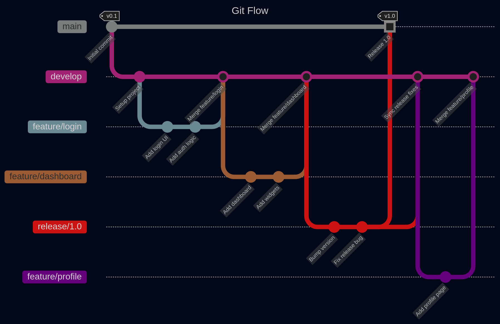
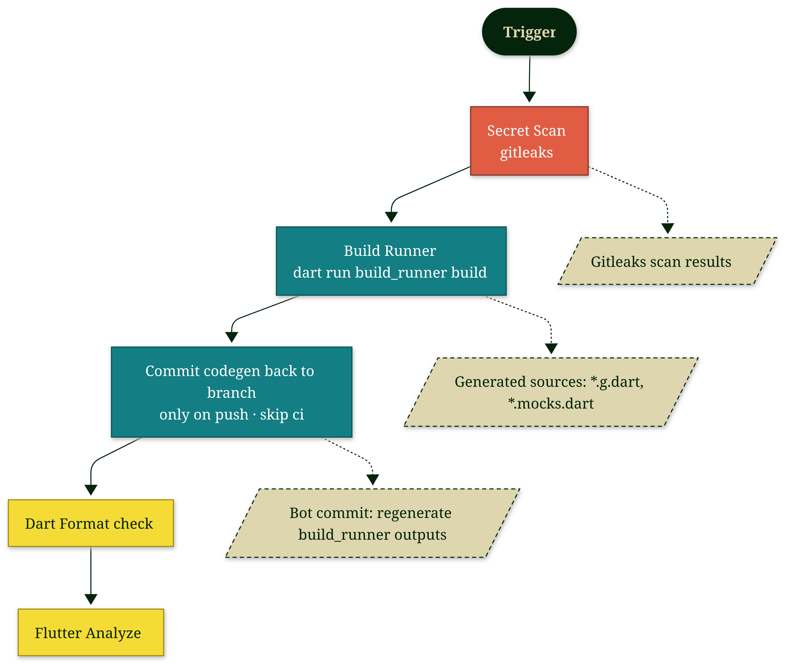
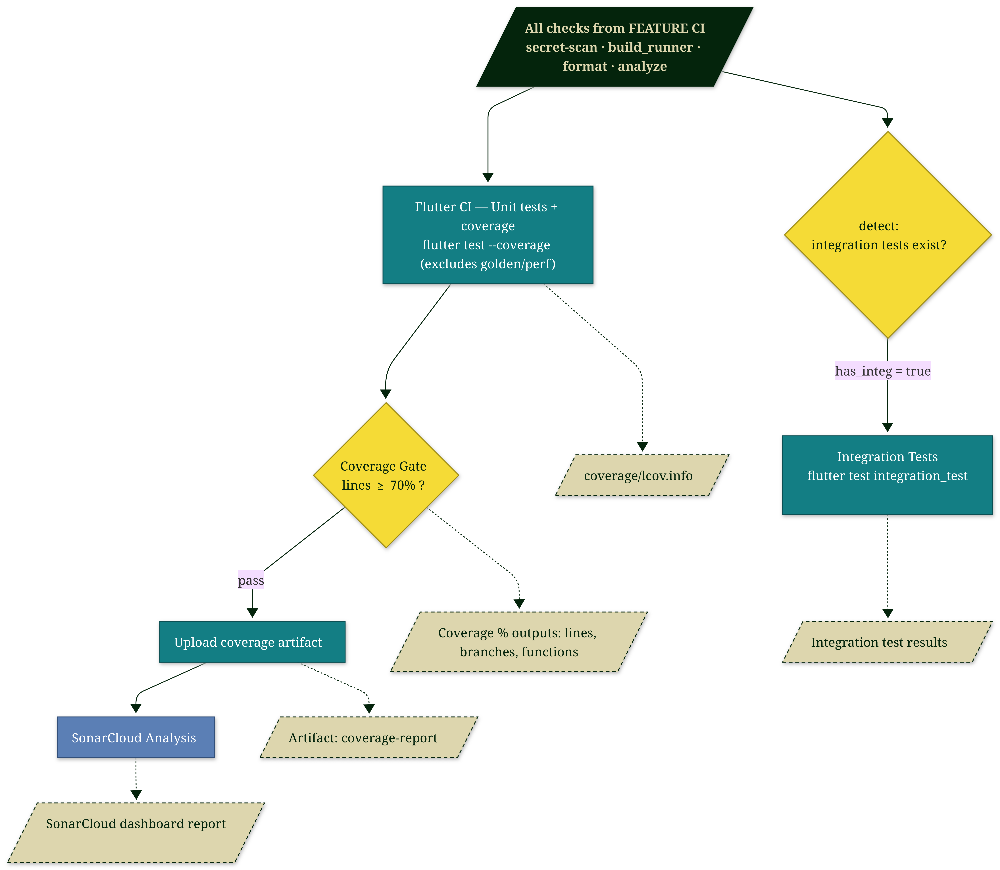
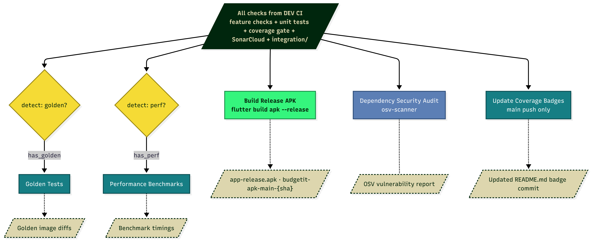

---

## Tech Stack

### Web

### Mobile

### Backend

          
          
            

### Database and Infrastructure

---
## Project Status

### Project Roadmap

| Demo     | Main Goals | Status                                                                                                                                                                                                          |
| ------   | ------     | ------                                                                                                                                                                                                          |
| **Demo 1**   | Foo        |                        |
| **Demo 2**   | Bar        |  |
| **Demo 3**   | Foo        |                         |
| **Demo 4**   | Bar        |                         |
---

### Issue Status  <svg height=20px width=20px xmlns="http://www.w3.org/2000/svg" viewBox="0 0 512 512"><!--!Font Awesome Free v7.2.0 by @fontawesome - https://fontawesome.com License - https://fontawesome.com/license/free Copyright 2026 Fonticons, Inc.--><path fill="#8957e6" d="M256 512a256 256 0 1 1 0-512 256 256 0 1 1 0 512zM374 145.7c-10.7-7.8-25.7-5.4-33.5 5.3L221.1 315.2 169 263.1c-9.4-9.4-24.6-9.4-33.9 0s-9.4 24.6 0 33.9l72 72c5 5 11.8 7.5 18.8 7s13.4-4.1 17.5-9.8L379.3 179.2c7.8-10.7 5.4-25.7-5.3-33.5z"/></svg>

---

### Build Status
| Branch | Status |
| --------------- | --------------- | 
| **Main**            | 1,2             |
| **Dev**             | 2,2             | 

---

### CI Status  

| Branch | Status |
| --------------- | --------------- | 
| **Main**            |     |
| **Dev**             |   |

---

### Code Quality  

| Quality Check | Status  |
| --------------- | --------------- |
| **Quality Gate**             |              |
| **Bugs**             |         |
| **Vulnerabilities**             |             |
| **Code Smells**                  |                          |
| **Duplicated Lines** |  |

---

### Code Coverage 

| Coverage Type | Percentage |
| --------------- | --------------- |
| **Lines** |  |
| **Branches** |  |
| **Functions** |  |

---

## Branching Strategy

---

## CI/CD 

### Feature Branches

### Dev Branch

### Main Branch

### Full Flow 

---
