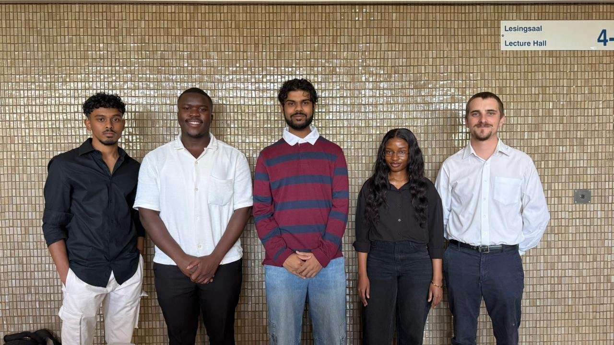
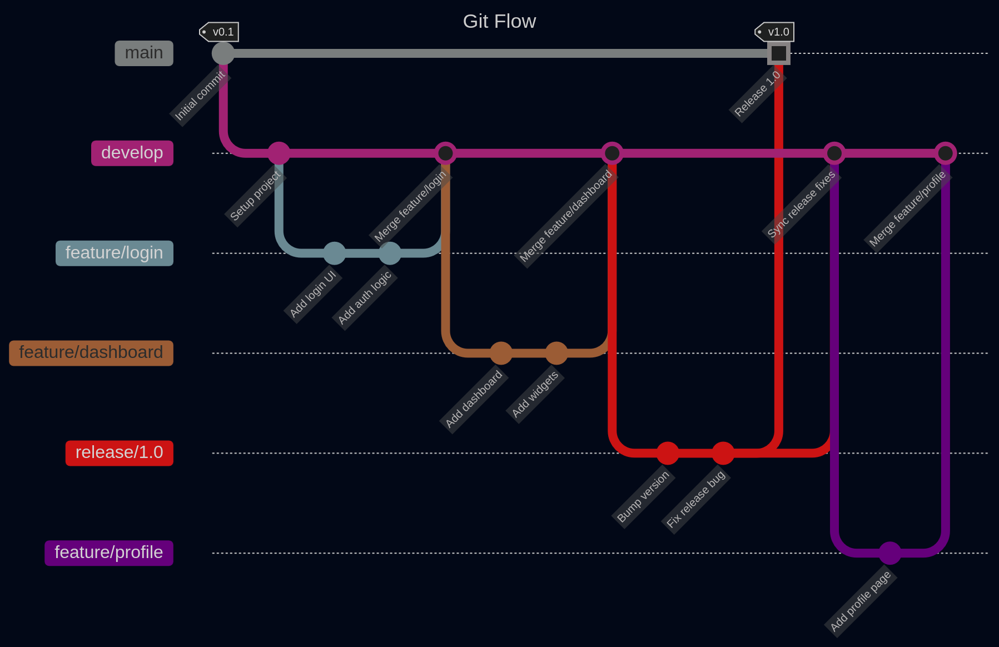
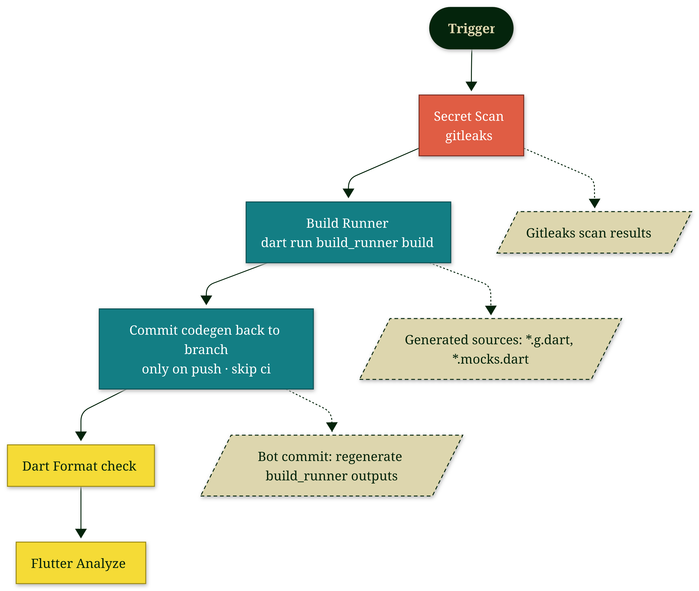
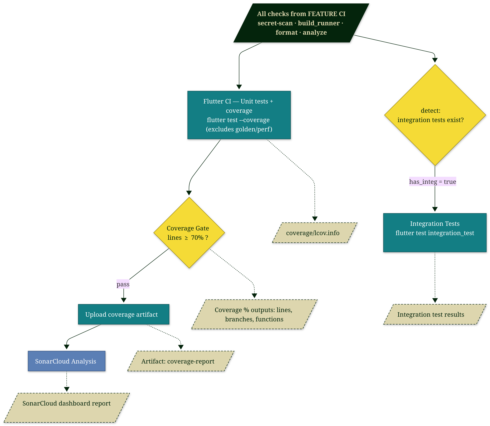
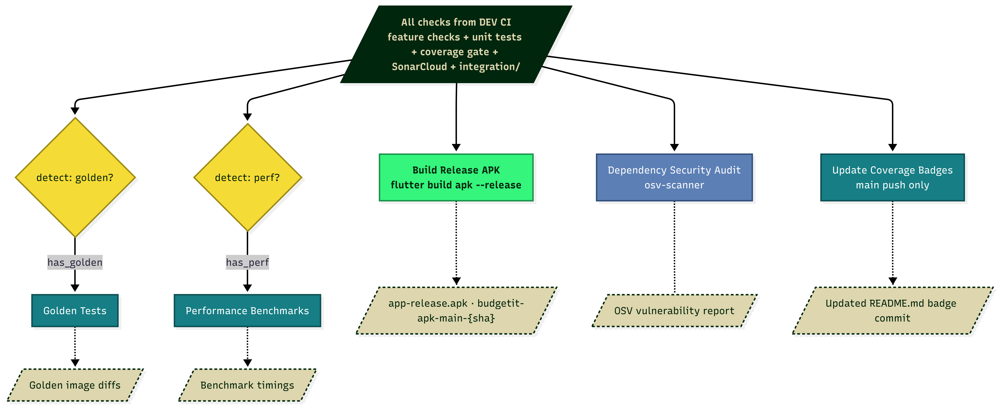

# Project Description
A mobile budgeting app designed to help users track income and expenses, manage budgets, import bank statements, and understand their spending through reports and insights.
## Project Documents

| Document | Description |
|---|---|
| [Software Requirements Specification (SRS)](docs/SRS.md) | Defines the system requirements, user stories, use cases, and functional scope of the application. |
| [Software Architecture Specification (SAS)](docs/SAS.pdf) | Describes the system architecture, design decisions, components, and technical structure. |
| [Coding Standards](docs/CodingStandards.md) | Outlines the coding conventions, formatting rules, naming guidelines, and development practices followed by the team. |
| [Testing Policy](docs/TestingPolicy.md) | Explains the testing approach, required test types, coverage expectations, and quality assurance process. |
| [User Manual](docs/UserManual.md) | Provides instructions for installing, navigating, and using the application. |
| [Brand Style Guide](docs/brandstyle.md) | Documents the project’s visual identity, typography, colours, and branding guidelines. |
##  Team

  

| Member | Role | LinkedIn |
| :--- | :--- | :---: |
| **Pavan Naidoo** | Scrum Master & Full-Stack Lead |  |
| **Lufuno Mphagi** | Backend & Data Lead |  |
| **Kiolin Gounden** | AI & Analytics Lead |  |
| **Jessica Marodi** | Frontend Lead & UI/UX |  |
| **Donovan Nelson** | DevOps & Infrastructure |  |

## Tech Stack

### Web

### Mobile

### Backend

          
          
            

### Database and Infrastructure

---
## Project Status

### Issue Status  <svg height=20px width=20px xmlns="http://www.w3.org/2000/svg" viewBox="0 0 512 512"><!--!Font Awesome Free v7.2.0 by @fontawesome - https://fontawesome.com License - https://fontawesome.com/license/free Copyright 2026 Fonticons, Inc.--><path fill="#8957e6" d="M256 512a256 256 0 1 1 0-512 256 256 0 1 1 0 512zM374 145.7c-10.7-7.8-25.7-5.4-33.5 5.3L221.1 315.2 169 263.1c-9.4-9.4-24.6-9.4-33.9 0s-9.4 24.6 0 33.9l72 72c5 5 11.8 7.5 18.8 7s13.4-4.1 17.5-9.8L379.3 179.2c7.8-10.7 5.4-25.7-5.3-33.5z"/></svg>

---

### Build Status
| Branch | Status |
| --------------- | --------------- | 
| **Main**            | 1,2             |
| **Dev**             | 2,2             | 

---

### CI Status  

| Branch | Status |
| --------------- | --------------- | 
| **Main**            |     |
| **Dev**             |   |

---

### Code Quality  

| Quality Check | Status  |
| --------------- | --------------- |
| **Quality Gate**             |              |
| **Bugs**             |         |
| **Vulnerabilities**             |             |
| **Code Smells**                  |                          |
| **Duplicated Lines** |  |

---

### Code Coverage 

| Branch | Coverage |
| --- | --- |
| **main** |  |
| **newdev** |  |

---

## Branching Strategy

---

## CI/CD 

### Feature Branches

### Dev Branch

### Main Branch

### Full Flow 

---
