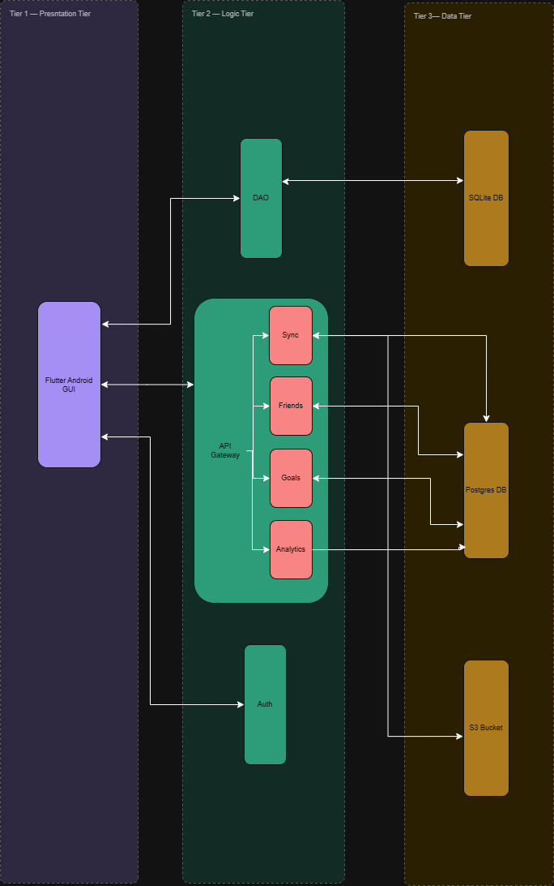

# Software Architecture Specification by DEV OOPS

- # Introduction
  Budget IT is an offline-first mobile budgeting application designed to help users track expenses, manage budgets, and visualize spending trends without dependence on constant internet connectivity. Unlike many competing budgeting apps, which assume near-continuous connectivity and degrade or become unusable without it, Budget IT is built from the ground up to function reliably offline, syncing data seamlessly once a connection becomes available.

  This document presents the software architecture of Budget IT, describing the key architectural decisions, patterns, and structures that enable this offline-first behavior. It outlines the system's major components, how they interact, and the rationale behind the chosen architectural style. The goal of this specification is to provide a clear technical reference for the development team, ensuring a shared understanding of the system's structure as implementation and testing proceed.

- # Architectural Requirements
    ## Architectural Patterns
       The system employs a three-tier architecture with microservices within the logic layer. This approach provides a clear separation of concerns, enabling robust parallel development. The use of microservices increases reliability through decentralised control and independent deployment, allowing core features to operate regardless of external or online dependencies.

       Alongside the API Gateway used for microservices, an Auth service (AWS Cognito) provides secure authentication — a feature paramount in a security-first application. DAOs offer a flexible and efficient interface with the local SQLite database, integrating cleanly with the Flutter GUI.

       Within the data layer, a deployed PostgreSQL database provides reliable and powerful storage backed by AWS hosting, while the local SQLite database delivers efficient on-device storage suited to mid-range devices without impacting performance. An S3 Bucket Store supports the Sync service by storing dumps of the local database, avoiding the need to sync the full database on every sync operation and thereby preventing redundancy and performance degradation.
    ## Design Patterns
    ### Singleton
           The **Singleton** pattern will be used for shared system resources such as the local database connection, authentication manager, and sync manager. This ensures that only one instance controls important resources during app execution.

       ---

    ### Factory Method
           The **Factory Method** pattern will be used when creating different types of transactions, such as income transactions, expense transactions, recurring transactions, or imported bank statement transactions. This improves flexibility when adding new transaction types later.

       ---

    ### Adapter
           The **Adapter** pattern will be used to connect the mobile app to external libraries or services, such as SQLite encryption, TensorFlow Lite/ONNX Runtime, biometric authentication, and cloud backup services. This prevents the app from depending directly on specific third-party implementations.

       ---

    ### Facade
           The **Facade** pattern will be used to provide a simple interface for complex subsystems such as statement importing, AI analysis, and synchronisation. For example, the app can call `importStatement()` without needing to know all the internal parsing, categorisation, and saving steps.

       ---

    ### Observer
           The **Observer** pattern will be used to automatically update parts of the system when data changes. For example, when a transaction is added, edited, or deleted, the dashboard, budget alerts, and charts can update immediately.

       ---

    ### Strategy
           The **Strategy** pattern will be used for bank statement parsing and transaction categorisation. Different banks may have different CSV or PDF formats, so each format can use its own parsing strategy without changing the rest of the system.

       ---

    ### State
          The **State** pattern will be used to manage connectivity and sync states, such as **Offline**, **Online**, **Syncing**, **Synced**, and **Sync Failed**. This helps the app behave correctly when the network connection changes.

    - ## Constraints

       - The application must remain **offline-first**. Core features must work without internet access.

       - The system must support **Guest Mode** and **Logged-in Mode**. In Guest Mode, the app must operate fully offline, and online features must be disabled.

       - Online functionality such as cloud backup, synchronisation, and account recovery must only be available to logged-in users.

       - Logged-in users must be able to switch supported online features on or off.

       - Online functionality must not replace or block offline functionality.

       - All financial data must be stored securely using **encrypted local storage**.

       - Financial data must not be transmitted to external servers unless the user gives explicit consent.

       - If a user disables sync or backup, their data must remain local to the device.

       - Switching between Guest Mode and Logged-in Mode must not cause data loss.

       - AI and ML features for spending analysis, auto-categorisation, anomaly detection, and financial health scoring must run **on-device** where possible.

       - The system must not rely on **cloud-based AI inference** for core AI features.

       - The application must perform acceptably on **typical mid-range mobile devices**.

       - The application must not consume excessive **battery, storage, or memory** during statement imports, AI analysis, or synchronisation.

       - Imported bank statements must be processed securely and stored locally, with temporary files removed after processing where possible.

       - The app must handle **network interruptions safely**. If synchronisation fails, local data must remain available and unchanged.

       - Online synchronisation must include **conflict-handling rules** to prevent duplicate or overwritten transactions.

       - The system must follow a **modular structure** so that different components can be tested, maintained, and improved independently.
       ## Architectural Diagram
       
       - ## Mapping Quality Requirements to Architectural Decisions

- # Technology Requirements
       ### Frontend

       Technology : Flutter
       Purpose : It enables efficient cross-platform mobile development while maintaining near-native performance.

       ### Local Database

       Technology : SQLite(Drift)
       SQLite provides lightweight, persistent local storage required for offline-first operation. Provides an on-device storage for transactions, budgets, and user preferences

       ### Data Access Layer

       DAO Pattern
       Abstracts database operations from business logic, improving maintainability and testability.

       ### Local Database Encryption

       SQLCipher
       Encrypts the SQLite database using AES-256 to protect sensitive financial information.

       ### Cloud Database

       PostgreSQL
       Stores synchronised user data and supports optional online features.
       PostgreSQL provides a reliable and scalable cloud database for synchronisation and collaborative features.

       ### Authentication

       AWS Cognito
       Provides secure user authentication, authorisation, and session management.
       Device Pin/Password.

       ### Cloud Storage

       Amazon S3
       Stores synchronisation artifacts and backup data used by the Sync Service.

       ### Machine Learning

       TensorFlow Lite
       Performs on-device transaction categorisation, anomaly detection, and financial analysis without requiring internet connectivity.

       TensorFlow Lite performs all machine learning inference locally, ensuring user privacy and eliminating dependence on cloud services.

       ### Version Control

       Git & GitHub is used for our source code management and collaborative development.GitHub Actions automates testing and integration, improving software quality and reducing deployment errors.

       ### Continuous Integration

       GitHub Actions automates building, testing, and validating code before deployment.

       ### Containerisation

       Docker provides consistent backend development and deployment environments.
    - # API Contracts
       The Mobile Budgeting App exposes RESTful APIs for optional online services including authentication, synchronisation, friend management, and shared savings goals. Core budgeting functionality does not depend on these APIs and remains fully operational offline.
       ## Authentication API

       POST /auth/login

       Authenticates a registered user using AWS Cognito credentials.

       Request

       {
       "email": "user@example.com",
       "password": "**\*\*\*\***"
       }

       Response

       {
       "accessToken": "jwt-token",
       "refreshToken": "refresh-token",
       "userId": "12345"
       }
       POST /auth/logout

       Invalidates the current session.

       Response

       {
       "success": true
       }

       ## Synchronisation API

       POST /sync/upload

       Uploads locally modified records to the cloud.

       Request

       {
       "deviceId": "device123",
       "lastSync": "2026-06-25T10:30:00Z",
       "transactions": [ ... ]
       }

       Response

       {
       "status": "success",
       "uploadedRecords": 15
       }
       GET /sync/download

       Downloads new or updated records from the cloud.

       Response

       {
       "transactions": [ ... ],
       "budgets": [ ... ],
       "categories": [ ... ]
       }

       ## Friends API

       Provides endpoints for managing friends and collaborative financial goals.

       Examples include:

       POST /friends/request
       GET /friends
       DELETE /friends/{id}

       ## Goals API

       Provides endpoints for creating and managing shared savings goals.

       - POST /goals
       - GET /goals
       - PUT /goals/{id}
       - DELETE /goals/{id}

- # Deployment
  ## Deployment Requirements
  ## Deployment Architecture
     The Mobile Budgeting App follows a hybrid deployment model consisting of an Android client application with optional cloud-based backend services.

    #### Client Device
       The following components are deployed on the user's mobile device:
       - Flutter application
       - SQLite database
       - SQLCipher encryption
       - TensorFlow Lite model
       - Local file storage
       - DAO layer

       These components allow all core budgeting functionality to operate without internet connectivity.

    #### Cloud Infrastructure

       Optional online features are deployed within AWS cloud services.

       Components include:

       - AWS Cognito for user authentication
       - PostgreSQL for synchronised user data
       - Amazon S3 for synchronisation storage
       - REST API backend for communication between the mobile application and cloud services

    ### Deployment Flow

       The user interacts with the Flutter application.

       - Financial data is stored locally in SQLite.
       - When online features are enabled, the Sync Service communicates with the backend REST API.
       - The backend authenticates requests using AWS Cognito.
       - Synchronised data is stored in PostgreSQL, while synchronisation artifacts are managed through Amazon S3.

    ### Continuous Integration and Deployment

       The project uses GitHub Actions to automate software quality assurance.

       The CI/CD pipeline performs:

       - Dependency installation
       - Static code analysis
       - Unit testing
       - Builds verification
       - Automated deployment of backend services

       This pipeline ensures that only validated code is merged into the main branch, improving software quality and reducing deployment risks

  ## Deployment Diagram
  ## CI/CD Pipeline Diagram
  
