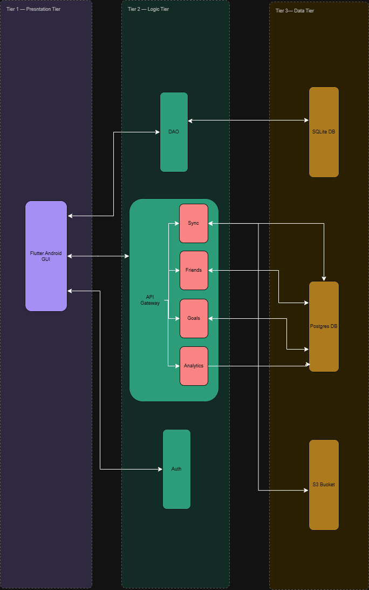

# Software Requirements Specification

---

## Table of Contents

- [1 Introduction](#1-introduction)
- [2 Requirements Overview](#2-requirements-overview)
- [3 User Stories / User Characteristics](#3-user-stories--user-characteristics)
- [4 Use Cases](#4-use-cases)
- [5 Functional Requirements](#5-functional-requirements)
- [6 Quality Requirements](#6-quality-requirements)

---

## 1 Introduction

### Business Need

South Africa's personal finance landscape presents a growing challenge: unreliable mobile connectivity, growing privacy concerns, and a market saturated by cloud-dependent applications. Existing tools mostly require account registration, store sensitive financial records on external servers, and become inaccessible when offline — making them impractical for users in low-connectivity environments or those uncomfortable with their data being visible to third parties.

### Project Scope

The Mobile Budgeting App is a cross-platform mobile application targeting Android primarily, with potential iOS support. Its scope is structured in three tiers.

**Core offline features** form the mandatory deliverable:
- Manual transaction entry, editing, and deletion
- Budget category management with spending limit alerts
- Bank statement import (CSV and PDF) with automatic transaction extraction and classification
- Financial dashboard with search and filter functionality
- Encrypted local data storage with device-level authentication

**AI features (on-device)** form the project's "wow factors":
- Automatic transaction categorisation using an on-device ML model
- Anomaly detection for unusual spending and predictive monthly spending forecasts
- Personal financial health scoring with plain-language insights

**Optional online features** are scoped as post-MVP enhancements:
- Secure user authentication via AWS Cognito
- Cross-device data synchronisation
- Friends list management and shared savings goals

The system does not rely on cloud infrastructure for any core feature. No financial data is transmitted to external servers without explicit user consent. All ML inference runs entirely on-device.

---

## 2 Requirements Overview

### Client Requirements

- Offline-first personal finance management with no internet connection required.
- Manual transaction entry, editing, and deletion.
- Bank statement import via CSV or PDF with automatic transaction extraction and classification.
- Monthly budget tracking per category with alerts when limits are approached or exceeded.
- Dashboard displaying income, expense, and budget summaries.
- Search and filter functionality by category, date range, or keyword.
- On-device AI analysis of spending behaviour and financial health.
- Online syncing to transfer data to another device.
- Optional online features (requiring internet connectivity):
  - Secure user authentication via AWS Cognito.
  - Automatic cross-device data synchronisation.
  - Friends list management for social finance features.
  - Goal sharing with friends (e.g., joint savings targets).

### Technical Requirements

- **System Limits**: The system operates primarily on-device; no core feature requires internet connectivity. Optional features may require network access.
- **External Integration**: Must interface with CSV and PDF bank statement formats for on-device parsing. Must integrate with AWS Cognito for optional online authentication. Must integrate with a remote sync backend (REST API + cloud database) for cross-device sync, friends lists, and shared goals.
- **Security**: All financial data stored in an encrypted local SQLite database; device-level authentication (PIN/biometrics) required. For optional online features: user credentials managed by AWS Cognito; data in transit encrypted via TLS 1.2+; shared goal data stored remotely with user consent and visible only to authorised participants.

### Non-Technical Requirements

- **Future Extensibility**: Multiple account/wallet tracking, receipt capture, and encrypted local backups are deferred to post-MVP. Online features (Cognito login, sync, friends lists, goal sharing) are post-MVP, but their interfaces are defined now to ensure modularity.
- **Modularity**: Features are segregated by sprint deliverables: transaction-core, budgeting, statement-import, ai-insights, online-auth, sync, and social.

---

## 3 User Stories / User Characteristics

### User Types

#### Guest User

A Guest User operates the application without an account, entirely in offline mode. All core features such as transaction management, budgeting, bank statement import, AI analysis, and dashboard reporting — are available. Data is stored in an encrypted local database and never transmitted externally. Guest users do not have access to cloud backup, cross-device sync, or social features.

**Typical profile:** A privacy-conscious individual, a student managing a tight budget, or a user in a low-connectivity environment who needs a zero-friction finance tracker.

**System usage:** The Guest User launches the app, authenticates with a PIN or biometrics, enters transactions or imports a bank statement, monitors spending against budget categories on the dashboard, and reviews AI-generated insights , without internet.

#### Registered User

A Registered User has created an account via AWS Cognito and may optionally enable online features. All core offline features remain fully accessible regardless of network state. When connected, the registered user gains access to cloud backup, cross-device sync, and social goal-sharing. Online features are user-controlled and can be disabled without affecting local data or offline functionality.

**Typical profile:** A working professional managing finances across multiple devices, or a user who wants the security of a cloud backup alongside full offline capability.

**System usage:** In addition to all Guest User capabilities, the Registered User authenticates with Cognito, enables sync, and can create shared savings goals with friends. Changes made offline are queued and synced automatically when connectivity is restored.

---

### User Stories

#### Transaction Management

| ID | User Story | Priority |
|---|---|---|
| US-01 | As a user, I want to manually add a transaction with a date, description, amount, and category so that I can track spending without internet access. | High |
| US-02 | As a user, I want to edit an existing transaction so that I can correct mistakes. | High |
| US-03 | As a user, I want to delete a transaction so that I can remove incorrect entries. | High |
| US-04 | As a user, I want to search and filter transactions by category, date range, or keyword so that I can find specific entries quickly. | High |

#### Budget Management

| ID | User Story | Priority |
|---|---|---|
| US-05 | As a user, I want to define a monthly spending limit per category so that I can control my budget. | High |
| US-06 | As a user, I want to receive an alert when my spending approaches or exceeds a category limit so that I can adjust my behaviour before overspending. | High |
| US-07 | As a user, I want to create custom categories so that I can organise transactions in a way that suits my lifestyle. | Medium |

#### Bank Statement Import

| ID | User Story | Priority |
|---|---|---|
| US-08 | As a user, I want to upload a bank statement in CSV or PDF format so that I do not have to enter each transaction manually. | High |
| US-09 | As a user, I want imported transactions to be automatically classified and categorised so that my budget summaries update without manual effort. | High |

#### Dashboard and Reporting

| ID | User Story | Priority |
|---|---|---|
| US-10 | As a user, I want to see a summary of my income, expenses, and budget status so that I understand my financial position at a glance. | High |
| US-11 | As a user, I want to view charts showing my spending distribution across categories so that I can identify patterns visually. | Medium |
| US-12 | As a user, I want to export my transaction history and budget summary to CSV or PDF so that I can archive or share my records. | Low |

#### Security and Authentication

| ID | User Story | Priority |
|---|---|---|
| US-13 | As a user, I want my financial data stored in an encrypted local database so that it is protected if my device is lost or stolen. | High |
| US-14 | As a user, I want to unlock the app with my PIN or biometrics so that access is quick and secure. | High |

#### AI and Insights

| ID | User Story | Priority |
|---|---|---|
| US-15 | As a user, I want the app to automatically categorise my imported transactions using ML so that I spend less time on manual entry. | High |
| US-16 | As a user, I want to be notified of unusual spending spikes so that I can investigate potential errors or unexpected charges. | High |
| US-17 | As a user, I want to see a predicted spending total for the rest of the month so that I can plan ahead. | Medium |
| US-18 | As a user, I want an AI-generated financial health score so that I can understand my overall financial wellbeing at a glance. | Medium |

#### Optional Online Features

| ID | User Story | Priority |
|---|---|---|
| US-19 | As a registered user, I want to log in with my AWS Cognito account so that I can access online features. | Low (post-MVP) |
| US-20 | As a registered user, I want my transactions and budgets synced across my devices so that I can manage finances on either device. | Low (post-MVP) |
| US-21 | As a registered user, I want to create a shared savings goal with friends so that we can track our progress together. | Low (post-MVP) |

---

## 4 Use Cases

### UC-01: Manage Transactions Manually

**Actor:** User (Guest or Registered)  
**Preconditions:** The app is installed, unlocked, and the user is on the main dashboard.  
**Postconditions:** The transaction is saved to the encrypted local database and dashboard totals are updated.

**TUCBW:** The user selects the option to add, edit or delete a new transaction.  
**TUCEW:** The transaction is stored or removed locally and the dashboard reflects the updated totals.

---

### UC-02: Manage Budget Categories and Alerts

**Actor:** User (Guest or Registered)  
**Preconditions:** The app is unlocked.  
**Postconditions:** Budget limits are saved per category; the system actively monitors spending against them.

**TUCBW:** The user navigates to the Budget Management screen.  
**TUCEW:** Budget limits are saved and the system monitors spending in real time, generating alerts when thresholds are crossed, default categories are provided and the user can also make custom categories.

---

### UC-03: Import Bank Statement and Auto-Classify

**Actor:** User (Guest or Registered)  
**Preconditions:** The app is unlocked. A bank statement in CSV or PDF format is saved on the device.  
**Postconditions:** Extracted transactions are saved locally, auto-categorised, and the dashboard is updated.

**TUCBW:** The user selects "Import Statement" from the menu.  
**TUCEW:** All valid transactions from the statement are saved to the local database.

---

### UC-04: View Dashboard and Search Transactions

**Actor:** User (Guest or Registered)  
**Preconditions:** The app is unlocked.  
**Postconditions:** The user views a financial summary and a filtered list of transactions.

**TUCBW:** The user opens the application and the dashboard is loaded.  
**TUCEW:** The user has reviewed their financial summary and navigated to a filtered transaction list.

---

### UC-05: Track Recurring Transactions 

**Actor:** User (Guest or Registered)  
**Preconditions:** The app is unlocked.  
**Postconditions:** A recurring transaction template is saved and the system generates entries on each scheduled date.

**TUCBW:** The user marks a transaction as recurring and configures a frequency.  
**TUCEW:** The recurring template is saved and future transactions will be generated automatically.

The user defines a recurring transaction with a frequency (daily, weekly, or monthly) and an optional end date. On each due date, the system generates a new transaction from the template. The user can edit the template (amount, category, or frequency) or deactivate it at any time. Deactivating stops future generation without deleting past transactions.

---

### UC-06: View Graphical Spending Reports

**Actor:** User (Guest or Registered)  
**Preconditions:** At least one transaction exists in the local database.  
**Postconditions:** The user has viewed a visual chart of their spending patterns.

**TUCBW:** The user navigates to the Reports screen and selects a time period.  
**TUCEW:** The system renders on-device charts and the user reviews their spending distribution.

The system renders charts from local transaction data — at minimum a pie/donut chart of spending by category. The user selects a time period and can drill down into a category to view the individual transactions that make up its total.

---

### UC-07: Export Financial Report 

**Actor:** User (Guest or Registered)  
**Preconditions:** At least one transaction exists.  
**Postconditions:** A report file is saved to device storage or shared via the OS share sheet.

**TUCBW:** The user selects "Export Report", chooses a date range, and selects a format (CSV or PDF).  
**TUCEW:** The export file is generated on-device and made available via device storage or the OS share sheet.

The system generates the file entirely on-device without transmitting data externally. A PDF export includes charts if available. The user may share or save the file using the standard OS share sheet.

---

### UC-08: Capture Receipt via Camera 

**Actor:** User (Guest or Registered)  
**Preconditions:** The device has a camera. The user is viewing a transaction detail screen.  
**Postconditions:** A receipt image is stored locally and linked to the transaction.

**TUCBW:** The user selects "Attach Receipt" on a transaction detail screen.  
**TUCEW:** The captured image is stored locally and linked to the transaction record.

The system requests camera permission only when this feature is first used. The captured image is stored locally and accessible from the transaction detail screen. Deleting the transaction offers the option to also delete the linked receipt image.

---

### UC-9: AI Spending Analysis and Auto-Categorisation 

**Actor:** User (Guest or Registered)  
**Preconditions:** The on-device ML model is loaded. At least one uncategorised transaction exists.  
**Postconditions:** All transactions are categorised and category-level overspend insights are stored and surfaced on the dashboard.

**TUCBW:** The user imports a bank statement or adds a transaction, triggering the analysis pipeline.  
**TUCEW:** All new transactions are categorised and plain-language insights are surfaced on the dashboard.

---

### UC-10: Anomaly Detection and Predictive Spending 

**Actor:** User (Guest or Registered)  
**Preconditions:** At least one full month of transaction history exists in the local database.  
**Postconditions:** Detected anomalies are stored and a spending prediction for the current month is generated.

**TUCBW:** The analysis engine runs after a new transaction is added or a batch import is completed.  
**TUCEW:** Anomalies are alerted to the user and a spending prediction with confidence range is displayed on the dashboard.

---

### UC-11: Personal Financial Health Score 

**Actor:** User (Guest or Registered)  
**Preconditions:** At least one month of transaction data exists and at least one budget category is defined.  
**Postconditions:** A health score (0–100) and plain-language insights are stored and displayed.

**TUCBW:** The user navigates to the "Financial Health" screen, or a new transaction triggers an analysis run.  
**TUCEW:** An updated health score with plain-language insights is displayed to the user.

---

### UC-12: Authenticate Online with AWS Cognito 

**Actor:** Registered User  
**Preconditions:** The device has internet connectivity. The user has not yet logged in.  
**Postconditions:** The user is authenticated via Cognito; a session token is stored securely on device.

**TUCBW:** The user navigates to Settings and selects "Sign In / Register" to enable online features.  
**TUCEW:** A valid session token is stored on the device and online features become available. All core offline features remain accessible.

Registration and login are handled via the AWS Cognito SDK. On successful authentication, a session token is stored in the device's secure storage. If the user is offline or chooses not to log in, all core features remain fully usable. Logging out clears the session token but does not delete local financial data.

---

### UC-13: Synchronise Data Across Devices 

**Actor:** Registered User  
**Preconditions:** The user is logged in on at least two devices. Network connectivity is available.  
**Postconditions:** Transactions, budgets, and categories are consistent across all the user's devices.

**TUCBW:** The app detects a network connection while the user is logged in, or the user manually triggers a sync.  
**TUCEW:** Local and remote data are consistent; sync status shows "Up to date".

Changes made while offline are queued locally. When connectivity is restored, the system flushes the queue to the remote backend. Conflicts — where the same record was modified on two devices — are resolved using a last-write-wins strategy by default, or a user-prompted resolution for significant divergences. Sync status (Syncing, Up to date, Offline, Error) is shown in the app at all times.

---

### UC-14: Manage Friends List 

**Actor:** Registered User  
**Preconditions:** The user is logged in and has network connectivity.  
**Postconditions:** The user's friends list is updated. No financial data is exposed.

**TUCBW:** The registered user navigates to the Friends section.  
**TUCEW:** Friend requests are sent, accepted, or declined; the user's friends list reflects the outcome.

Users search for others by email or username. No financial data is exposed through this feature. A friend request requires the recipient's explicit consent before the friendship is recorded. Users can view their friends list and remove any friend at any time.

---

### UC-15: Share and Track Goals with Friends 

**Actor:** Registered User  
**Preconditions:** The user is logged in, has network connectivity, and has at least one friend.  
**Postconditions:** A shared goal is created; all invited participants can view and contribute to it.

**TUCBW:** The registered user creates a new shared goal and invites one or more friends.  
**TUCEW:** All invited participants can see the goal, record contributions, and view combined progress.

The user defines a shared goal with a name, target amount, and optional end date, and selects participants from their friends list. Each participant records contribution entries (amount, date, optional note). Individual contributions are visible only to goal members. A progress bar shows the combined total against the target. A user may leave a goal at any time; their past contributions remain on record and remaining participants are notified.

---

### Use Case Diagrams

## 5 Functional Requirements

Requirements are assigned to the six subsystems as followed: 

---

#### R1: Transaction Management

- **R1.1: Manual Transaction Entry**
  - R1.1.1: The system shall allow a User to manually create a transaction with date, description, amount and category.
  - R1.1.2: The system shall allow a User to edit or delete an existing transaction.
- **R1.2: Transaction Retrieval**
  - R1.2.1: The system shall allow a User to view all transactions, filterable by category, date range or keyword.

#### R2: Budget Management

- **R2.1: Budget Definition**
  - R2.1.1: The system shall allow a User to define a monthly budget limit per category.
  - R2.1.2: The system shall support both predefined and custom categories.
- **R2.2: Budget Alerts**
  - R2.2.1: The system shall notify a User when spending approaches or exceeds a defined budget limit.

#### R3: Bank Statement Import & Classification

- **R3.1: Statement Upload**
  - R3.1.1: The system shall allow a User to upload a bank statement in CSV or PDF format.
- **R3.2: Auto-Classification**
  - R3.2.1: The system shall automatically extract dates, descriptions and amounts from uploaded statements.
  - R3.2.2: The system shall classify extracted transactions as income or expenses and assign categories.

#### R4: Dashboard & Reporting

- **R4.1: Financial Summary**
  - R4.1.1: The system shall display a dashboard showing income totals, expense totals and budget summaries.
  - R4.1.2: The system shall present financial summaries using charts and visual analytics.

#### R5: On-Device AI

- **R5.1: Spending Analysis**
  - R5.1.1: The system shall use an on-device ML model (TensorFlow Lite or ONNX Runtime) to automatically categorise transactions.
  - R5.1.2: The system shall detect spending categories where a User consistently overspends.
- **R5.2: Anomaly Detection & Prediction**
  - R5.2.1: The system shall detect unusual financial activity and sudden spending spikes.
  - R5.2.2: The system shall predict future spending trends from historical transaction data.
- **R5.3: Financial Health Score**
  - R5.3.1: The system shall generate an AI-driven financial health score based on spending behaviour and income stability.
  - R5.3.2: The system shall provide plain-language insights about financial habits, entirely on-device with no data leaving the phone.

#### R6: Online Authentication 

- R6.1: The system shall allow a User to optionally register and log in using AWS Cognito.
- R6.2: The system shall maintain a local session token; core features remain usable without online login.
- R6.3: The system shall not require online authentication for any core (offline) feature.

#### R7: Cross-Device Synchronisation 

- R7.1: The system shall, when a User is logged in online, synchronise transactions, budgets, and categories across multiple devices owned by the same User.
- R7.2: The system shall resolve conflicts using a last-write-wins or user-prompted strategy.
- R7.3: The system shall indicate sync status (syncing, success, failed, offline) within the app.
- R7.4: The system shall queue local changes when offline and sync automatically when connectivity is restored.

#### R8: Friends List Management 

- R8.1: The system shall allow a logged-in User to send, accept, or decline friend requests.
- R8.2: The system shall display a list of current friends.
- R8.3: The system shall allow a User to remove a friend from their list.
- R8.4: The system shall not expose any financial data through the friends list feature unless explicitly shared via goals (R9).

#### R9: Goal Sharing 

- R9.1: The system shall allow a logged-in User to create a shared savings or spending goal with one or more friends.
- R9.2: The system shall allow participants to contribute progress toward the shared goal (e.g., amount saved).
- R9.3: The system shall show each participant’s contribution and the combined progress.
- R9.4: The system shall allow a User to leave a shared goal, with remaining participants notified.
- R9.5: The system shall keep all shared goal data encrypted in transit and at rest on remote servers.

---
---

## 6 Quality Requirements

### Performance

| ID | Requirement | Quantified Measure |
|---|---|---|
| QR-P1 | The app shall reach the dashboard from a cold start. | ≤ 2 seconds on a Snapdragon 665-class device with 4 GB RAM |
| QR-P2 | The dashboard shall load all current-month summaries and charts on navigation. | ≤ 1 second |
| QR-P3 | Transaction search results shall update as the user types. | ≤ 300 ms per query |

---

### Security

| ID | Requirement | Quantified Measure |
|---|---|---|
| QR-S1 | All financial data stored on the device shall be encrypted at rest. | AES-256 via SQLCipher; verified by attempting direct file access without the key |
| QR-S2 | All data transmitted between the device and remote services shall be encrypted in transit. | TLS 1.2 minimum; verified by network interception tests |
| QR-S3 | The application shall transmit zero financial data to external servers without explicit user consent. | 0 unauthorised outbound financial data requests; verified by network monitoring tests |
| QR-S4 | Repeated failed authentication attempts shall result in a lockout. | App locks after 5 consecutive failures; 30-second timeout per lockout cycle |

---

### Reliability

| ID | Requirement | Quantified Measure |
|---|---|---|
| QR-R1 | All core features shall be available without internet connectivity. | 100% offline availability; verified by full test suite execution in flight mode |
| QR-R2 | Local data shall remain fully intact following an unexpected app termination. | Zero data loss on forced-kill tests across 10 consecutive test runs |
| QR-R3 | If synchronisation fails, local data shall remain unchanged. | Zero data loss or corruption on sync failure; verified by simulated network drop tests |
| QR-R4 | The duplicate detection mechanism shall prevent re-importing previously imported transactions. | Duplicate detection accuracy ≥ 99% on a standardised 500-row test dataset |

---

### Scalability

| ID | Requirement | Quantified Measure |
|---|---|---|
| QR-SC1 | The local database shall support large transaction histories without performance degradation. | Up to 10,000 transactions with dashboard load remaining ≤ 1 second |
| QR-SC2 | The system shall support a sufficient number of user-defined categories. | Up to 50 custom categories without UI or query performance degradation |
| QR-SC3 | The AI analysis pipeline shall operate over an extended transaction history. | Up to 24 months of historical data; analysis completion ≤ 10 seconds |

---

### Maintainability

| ID | Requirement | Quantified Measure |
|---|---|---|
| QR-M1 | The system shall follow a modular architecture where each subsystem can be developed, tested, and updated independently. | Verified by component isolation tests and architecture documentation review |
| QR-M2 | Core modules (transaction management, budget logic, statement parsing) shall maintain minimum unit test coverage. | ≥ 80% unit test coverage per module, enforced by CI/CD pipeline |
| QR-M3 | All code changes shall be validated by the automated pipeline before merging to the main branch. | 0 merges to main without a passing GitHub Actions build and test run |
| QR-M4 | The on-device ML model shall be replaceable without requiring changes to the application business logic. | Model swap verified via the Adapter pattern interface; no changes required in layers above the AI/Processing Layer |

---

### Usability

| ID | Requirement | Quantified Measure |
|---|---|---|
| QR-U1 | The application shall support both light and dark themes. | User-selectable via settings; theme preference persisted across sessions |
| QR-U2 | A first-time user shall be able to complete onboarding and add their first transaction without external assistance. | Onboarding completion within 3 minutes in usability testing with five representative users |
| QR-U3 | The application shall render smoothly on devices of varying hardware capability. | No dropped frames (< 60 fps) on Snapdragon 665-class hardware during standard navigation |

---

## Architecture

The system employs a three-tier architecture with microservices within the logic layer. This approach provides a clear separation of concerns, enabling robust parallel development. The use of microservices increases reliability through decentralised control and independent deployment, allowing core features to operate regardless of external or online dependencies.

Alongside the API Gateway used for microservices, an Auth service (AWS Cognito) provides secure authentication — a feature paramount in a security-first application. DAOs offer a flexible and efficient interface with the local SQLite database, integrating cleanly with the Flutter GUI.

Within the data layer, a deployed PostgreSQL database provides reliable and powerful storage backed by AWS hosting, while the local SQLite database delivers efficient on-device storage suited to mid-range devices without impacting performance. An S3 Bucket Store supports the Sync service by storing dumps of the local database, avoiding the need to sync the full database on every sync operation and thereby preventing redundancy and performance degradation.

> **Note:** This architecture is a preliminary design and is subject to change in accordance with our agile philosophy.

