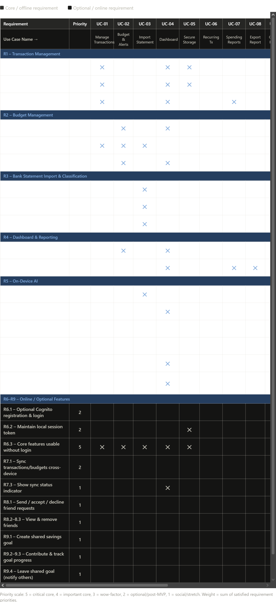

# Personal Finance Management System – Requirements & Use Cases

## Requirements

### Client Requirements

- Offline-first personal finance management with no internet connection required.
- Manual transaction entry, editing and deletion.
- Bank statement import via CSV or PDF with automatic transaction extraction and classification.
- Monthly budget tracking per category with alerts when limits are approached or exceeded.
- Dashboard displaying income, expense and budget summaries.
- Search and filter functionality by category, date range or keyword.
- On-device AI analysis of spending behaviour and financial health.
- Online synching so that data may be transferred to another device.
- Optional online features (requiring internet connectivity):
  - Secure user authentication via AWS Cognito.
  - Automatic cross-device data synchronisation.
  - Friends list management for social finance features.
  - Goal sharing with friends (e.g., joint savings targets).

### Technical Requirements

- **System Limits**: The system operates firstly on-device; no core feature requires internet connectivity. Wow factors and additional features may, however, require network connectivity.
- **External Integration**: Must interface with CSV and PDF bank statement formats for on-device parsing and classification only. Must interface with other external APIs for prediction models. Must integrate with a remote database for additional features. Must integrate with:
  - AWS Cognito for optional online authentication.
  - A remote sync backend (e.g., REST API + cloud database) for cross-device data synchronisation, friends lists, and shared goals.
- **Security**: All financial data stored in an encrypted local SQLite database; device-level authentication (PIN/biometrics) is required. Auth is handled at the device level and through a login system for additional functionality. For optional online features:
  - User credentials and session tokens managed by AWS Cognito.
  - Data transmitted during sync is encrypted in transit (TLS 1.2+).
  - Shared goal data stored remotely with user consent and visible only to authorised friends.

### Non-Technical Requirements

- **Future Extensibility**: System design defers multiple account/wallet tracking, receipt capture, and encrypted local backups to post-MVP development cycles while preserving immediate schema clarity. The system also plans to implement many advanced features such as synching and goal sharing during post-MVP development cycles which require online functionality. The optional online features (Cognito login, sync, friends lists, goal sharing) are explicitly scoped as post-MVP enhancements but their interfaces are defined now to ensure modularity.
- **Modularity**: Features remain segregated by sprint deliverables (transaction-core vs budgeting vs statement-import vs ai-insights vs online-auth vs sync vs social).

### Functional Requirements

#### R1: Transaction Management

- **R1.1: Manual Transaction Entry**
  - R1.1.1: The system shall allow a User to manually create a transaction with date, description, amount and category.
  - R1.1.2: The system shall allow a User to edit or delete an existing transaction.
- **R1.2: Transaction Retrieval**
  - R1.2.1: The system shall allow a User to view all transactions, filterable by category, date range or keyword.

#### R2: Budget Management

- **R2.1: Budget Definition**
  - R2.1.1: The system shall allow a User to define a monthly budget limit per category.
  - R2.1.2: The system shall support both predefined and custom categories.
- **R2.2: Budget Alerts**
  - R2.2.1: The system shall notify a User when spending approaches or exceeds a defined budget limit.

#### R3: Bank Statement Import & Classification

- **R3.1: Statement Upload**
  - R3.1.1: The system shall allow a User to upload a bank statement in CSV or PDF format.
- **R3.2: Auto-Classification**
  - R3.2.1: The system shall automatically extract dates, descriptions and amounts from uploaded statements.
  - R3.2.2: The system shall classify extracted transactions as income or expenses and assign categories.

#### R4: Dashboard & Reporting

- **R4.1: Financial Summary**
  - R4.1.1: The system shall display a dashboard showing income totals, expense totals and budget summaries.
  - R4.1.2: The system shall present financial summaries using charts and visual analytics.

#### R5: On-Device AI

- **R5.1: Spending Analysis**
  - R5.1.1: The system shall use an on-device ML model (TensorFlow Lite or ONNX Runtime) to automatically categorise transactions.
  - R5.1.2: The system shall detect spending categories where a User consistently overspends.
- **R5.2: Anomaly Detection & Prediction**
  - R5.2.1: The system shall detect unusual financial activity and sudden spending spikes.
  - R5.2.2: The system shall predict future spending trends from historical transaction data.
- **R5.3: Financial Health Score**
  - R5.3.1: The system shall generate an AI-driven financial health score based on spending behaviour and income stability.
  - R5.3.2: The system shall provide plain-language insights about financial habits, entirely on-device with no data leaving the phone.

#### R6: Online Authentication (Optional)

- R6.1: The system shall allow a User to optionally register and log in using AWS Cognito.
- R6.2: The system shall maintain a local session token; core features remain usable without online login.
- R6.3: The system shall not require online authentication for any core (offline) feature.

#### R7: Cross-Device Synchronisation (Optional)

- R7.1: The system shall, when a User is logged in online, synchronise transactions, budgets, and categories across multiple devices owned by the same User.
- R7.2: The system shall resolve conflicts using a last-write-wins or user-prompted strategy.
- R7.3: The system shall indicate sync status (syncing, success, failed, offline) within the app.
- R7.4: The system shall queue local changes when offline and sync automatically when connectivity is restored.

#### R8: Friends List Management (Optional)

- R8.1: The system shall allow a logged-in User to send, accept, or decline friend requests.
- R8.2: The system shall display a list of current friends.
- R8.3: The system shall allow a User to remove a friend from their list.
- R8.4: The system shall not expose any financial data through the friends list feature unless explicitly shared via goals (R9).

#### R9: Goal Sharing (Optional)

- R9.1: The system shall allow a logged-in User to create a shared savings or spending goal with one or more friends.
- R9.2: The system shall allow participants to contribute progress toward the shared goal (e.g., amount saved).
- R9.3: The system shall show each participant’s contribution and the combined progress.
- R9.4: The system shall allow a User to leave a shared goal, with remaining participants notified.
- R9.5: The system shall keep all shared goal data encrypted in transit and at rest on remote servers.

---

## Use Cases

### UC-01 Manage transactions manually

**Actor:** User

**User stories & acceptance criteria**

- As a user, I want to manually add a transaction with a date, description, amount, and category so that I can track spending without internet access.
  - *Acceptance criteria:* Transaction is saved to encrypted local database.
- As a user, I want to edit an existing transaction so that I can correct mistakes.
  - *Acceptance criteria:* Edited data persists on device after app restart.
- As a user, I want to delete a transaction so that I can remove incorrect entries.
  - *Acceptance criteria:* User is prompted to confirm deletion. Deleted transaction is removed from all summaries.

### UC-02 Manage budget categories & alerts

**Actor:** User

**User stories & acceptance criteria**

- As a user, I want to assign transactions to predefined or custom categories so that I can organise my spending.
  - *Acceptance criteria:* Default categories are available on first launch. User can create custom categories (optional feature). Category selection shown during transaction entry.
- As a user, I want to set a monthly spending limit per category so that I can control my budget.
  - *Acceptance criteria:* Limit is stored locally and persists across sessions. Budget progress is visible on the dashboard.
- As a user, I want to receive an alert when my spending approaches or exceeds a category limit so that I can adjust my behaviour.
  - *Acceptance criteria:* Alert triggers at a configurable threshold (e.g., 80% and 100%). Alert is displayed in-app; no internet required.

### UC-03 Import bank statement

**Actor:** User

**User stories & acceptance criteria**

- As a user, I want to upload a CSV or PDF bank statement so that transactions are imported automatically.
  - *Acceptance criteria:* CSV and PDF formats supported. Dates, descriptions, and amounts extracted on-device. No data sent to external servers during processing.
- As a user, I want imported transactions to be automatically classified as income or expenses and assigned a category so that I do not have to categorise them manually.
  - *Acceptance criteria:* ML model classifies transactions using on-device inference. User can override any auto-assigned category. Duplicate detection prevents re-importing the same transactions.

### UC-04 View financial dashboard

**Actor:** User

**User stories & acceptance criteria**

- As a user, I want to see a summary of my income, expenses, and budget status so that I understand my financial position at a glance.
  - *Acceptance criteria:* Dashboard loads without internet connectivity. Shows totals for current month by default. Budget progress bars visible per category.
- As a user, I want to search and filter transactions by category, date range, or keyword so that I can find specific entries quickly.
  - *Acceptance criteria:* Search results update in real time. Filters can be combined. Empty state shown when no results match.

### UC-05 Secure local storage & authentication

**Actor:** User

**User stories & acceptance criteria**

- As a user, I want my financial data stored in an encrypted local database so that it is protected if my device is lost or stolen.
  - *Acceptance criteria:* SQLite database encrypted at rest. Data inaccessible without device authentication. No plain-text data written to device storage.
- As a user, I want to unlock the app using my PIN or biometrics so that access is quick and secure.
  - *Acceptance criteria:* Biometric prompt uses device OS APIs. Falls back to PIN if biometrics unavailable. App locks automatically after a configurable idle period.

### UC-06 Track recurring transactions (Optional)

**Actor:** User

**User stories & acceptance criteria**

- As a user, I want to mark a transaction as recurring (e.g., salary, subscription) so that it is automatically added each period.
  - *Acceptance criteria:* User sets frequency: daily, weekly, monthly. Recurring transaction appears on the scheduled date. User can edit or cancel the recurrence at any time.

### UC-07 View graphical spending reports (Optional)

**Actor:** User

**User stories & acceptance criteria**

- As a user, I want to view charts showing my spending distribution across categories so that I can spot patterns visually.
  - *Acceptance criteria:* Charts rendered on-device without internet. Supports at minimum pie/donut chart by category. Drilldown to transactions for a selected category.

### UC-08 Export financial report (Optional)

**Actor:** User

**User stories & acceptance criteria**

- As a user, I want to export my transaction history and budget summary to CSV or PDF so that I can share or archive my records.
  - *Acceptance criteria:* Export covers user-selected date range. PDF includes charts if available. File saved to device local storage or shared via OS share sheet.

### UC-09 Capture receipt via camera (Optional)

**Actor:** User

**User stories & acceptance criteria**

- As a user, I want to photograph a receipt and attach it to a transaction so that I have a record of the purchase.
  - *Acceptance criteria:* Camera permission requested only when feature is used. Image stored locally and linked to the transaction. Image viewable from transaction detail screen.

### UC-10 AI spending analysis & auto-categorisation (Wow factor)

**Actor:** User

**User stories & acceptance criteria**

- As a user, I want the app to automatically categorise my bank statement transactions using ML so that I spend less time on manual entry.
  - *Acceptance criteria:* ML model runs entirely on-device (TensorFlow Lite or ONNX Runtime). Categorisation accuracy improves as more transactions are labelled. No financial data leaves the device during inference.
- As a user, I want the app to highlight categories where I consistently overspend so that I can focus my attention on problem areas.
  - *Acceptance criteria:* Overspend patterns derived from at least 2 months of history. Insight displayed in plain language on the dashboard. User can dismiss or snooze a particular insight.

### UC-11 Anomaly detection & predictive spending (Wow factor)

**Actor:** User

**User stories & acceptance criteria**

- As a user, I want to be notified of unusual spending spikes so that I can investigate potential errors or fraud.
  - *Acceptance criteria:* Anomaly detected when a transaction is significantly above historical average for that category. Alert shown in-app with the transaction details. User can mark the transaction as 'expected' to train the model.
- As a user, I want to see a predicted spending total for the rest of the month so that I can plan ahead.
  - *Acceptance criteria:* Prediction based on historical transaction data stored on-device. Confidence range shown alongside the prediction. Requires at least one full month of data to activate.

### UC-12 Personal financial health score (Wow factor)

**Actor:** User

**User stories & acceptance criteria**

- As a user, I want to see an AI-generated financial health score so that I can understand my overall financial wellbeing at a glance.
  - *Acceptance criteria:* Score computed on-device from spending behaviour and income stability. Plain-language explanation provided alongside the score. Score updates when new transactions are added or imported. No data transmitted off-device to compute the score.

### UC-13 Authenticate online with Cognito (Optional / Online)

**Actor:** User

**User stories & acceptance criteria**

- As a user, I want to optionally register and log in using my AWS Cognito account so that I can access online features like sync and goal sharing.
  - *Acceptance criteria:* Registration and login use Cognito hosted UI or native SDK. After login, a session token is stored securely on device. If offline or user chooses not to log in, all core features remain fully usable. Logout clears the session token but does not delete local financial data.

### UC-14 Synchronise data across devices (Optional / Online)

**Actor:** User

**User stories & acceptance criteria**

- As a user, I want my transactions, budgets, and categories to be synced automatically across my phone and tablet so that I can manage finances on either device.
  - *Acceptance criteria:* Sync occurs only when user is logged in and network is available. Changes made offline are queued and synced when connection returns. Conflicts (same transaction edited on two devices) are resolved with a clear rule (e.g., last-write-wins or user prompt). Sync status indicator shows “Syncing”, “Up to date”, “Offline”, or “Error”.

### UC-15 Manage friends list (Optional / Online)

**Actor:** User

**User stories & acceptance criteria**

- As a user, I want to send a friend request to another user so that we can later share financial goals.
  - *Acceptance criteria:* Friend search is performed by email or username (no financial data exposed). Friend request requires the recipient’s consent. User can view a list of current friends and remove any friend at any time.
- As a user, I want to accept or decline incoming friend requests so that I control who can interact with me.
  - *Acceptance criteria:* In-app notification (or badge) shows pending requests. Accepted friends appear in the friends list; declined requests are discarded.

### UC-16 Share and track goals with friends (Optional / Online)

**Actor:** User

**User stories & acceptance criteria**

- As a user, I want to create a shared goal (e.g., “Trip to Japan – $2000”) with selected friends so that we can save together.
  - *Acceptance criteria:* Goal includes a target amount, end date (optional), and list of invited friends (must be existing friends). Each participant sees the goal in their own app. Goal data is stored remotely but not shared with non-participants.
- As a user, I want to record my contribution toward a shared goal so that everyone can see combined progress.
  - *Acceptance criteria:* Contribution is a manual entry (amount, date, optional note). Each participant’s individual contribution is visible only to goal members. Progress bar shows combined total vs target.
- As a user, I want to leave a shared goal so that I no longer participate.
  - *Acceptance criteria:* Leaving removes the user from the goal but does not delete past contribution records. Remaining participants receive a notification that the user has left.

---

### Use Case Traceablity Matrix

### Use Case Diagrams

@startuml Core_Transaction_Management

skinparam actorStyle awesome
skinparam packageStyle rectangle
skinparam usecase {
  BackgroundColor LightYellow
  BorderColor DarkGoldenRod
  ArrowColor DarkSlateGray
}
skinparam actor {
  BackgroundColor LightBlue
  BorderColor DarkBlue
}

left to right direction

actor "User" as User

rectangle "Core: Transaction Management" {
  usecase "UC-01\nManage Transactions\nManually" as UC01
  usecase "UC-04\nView Financial\nDashboard" as UC04
  usecase "UC-05\nSecure Local Storage\n& Authentication" as UC05
  usecase "UC-06\nTrack Recurring\nTransactions" as UC06
}

User --> UC01
User --> UC04
User --> UC05
User --> UC06

@enduml

@startuml Core_Budget_Management

skinparam actorStyle awesome
skinparam packageStyle rectangle
skinparam usecase {
  BackgroundColor LightYellow
  BorderColor DarkGoldenRod
  ArrowColor DarkSlateGray
}
skinparam actor {
  BackgroundColor LightBlue
  BorderColor DarkBlue
}

left to right direction

actor "User" as User

rectangle "Core: Budget Management" {
  usecase "UC-02\nManage Budget\nCategories & Alerts" as UC02
}

User --> UC02

@enduml

@startuml Core_Statement_Import

skinparam actorStyle awesome
skinparam packageStyle rectangle
skinparam usecase {
  BackgroundColor LightYellow
  BorderColor DarkGoldenRod
  ArrowColor DarkSlateGray
}
skinparam actor {
  BackgroundColor LightBlue
  BorderColor DarkBlue
}

left to right direction

actor "User" as User

rectangle "Core: Statement Import" {
  usecase "UC-03\nImport Bank\nStatement" as UC03
}

User --> UC03

@enduml

@startuml Core_Reporting

skinparam actorStyle awesome
skinparam packageStyle rectangle
skinparam usecase {
  BackgroundColor LightYellow
  BorderColor DarkGoldenRod
  ArrowColor DarkSlateGray
}
skinparam actor {
  BackgroundColor LightBlue
  BorderColor DarkBlue
}

left to right direction

actor "User" as User

rectangle "Core: Reporting" {
  usecase "UC-07\nView Graphical\nSpending Reports" as UC07
  usecase "UC-08\nExport Financial\nReport" as UC08
  usecase "UC-09\nCapture Receipt\nvia Camera" as UC09
}

User --> UC07
User --> UC08
User --> UC09

@enduml

@startuml OnDevice_AI

skinparam actorStyle awesome
skinparam packageStyle rectangle
skinparam usecase {
  BackgroundColor LightYellow
  BorderColor DarkGoldenRod
  ArrowColor DarkSlateGray
}
skinparam actor {
  BackgroundColor LightBlue
  BorderColor DarkBlue
}

left to right direction

actor "User" as User

rectangle "On-Device AI (Wow Factors)" {
  usecase "UC-10\nAI Spending Analysis\n& Auto-Categorisation" as UC10
  usecase "UC-11\nAnomaly Detection &\nPredictive Spending" as UC11
  usecase "UC-12\nPersonal Financial\nHealth Score" as UC12
}

User --> UC10
User --> UC11
User --> UC12

@enduml

@startuml Online_Authentication_Sync

skinparam actorStyle awesome
skinparam packageStyle rectangle
skinparam usecase {
  BackgroundColor LightYellow
  BorderColor DarkGoldenRod
  ArrowColor DarkSlateGray
}
skinparam actor {
  BackgroundColor LightBlue
  BorderColor DarkBlue
}

left to right direction

actor "User" as User

rectangle "Online: Authentication & Sync" {
  usecase "UC-13\nAuthenticate Online\nwith Cognito" as UC13
  usecase "UC-14\nSynchronise Data\nAcross Devices" as UC14
}

User --> UC13
User --> UC14

UC14 ..> UC13 : <<include>>

@enduml

@startuml Online_Social_Features

skinparam actorStyle awesome
skinparam packageStyle rectangle
skinparam usecase {
  BackgroundColor LightYellow
  BorderColor DarkGoldenRod
  ArrowColor DarkSlateGray
}
skinparam actor {
  BackgroundColor LightBlue
  BorderColor DarkBlue
}

left to right direction

actor "User" as User

rectangle "Online: Social Features" {
  usecase "UC-15\nManage Friends\nList" as UC15
  usecase "UC-16\nShare & Track\nGoals with Friends" as UC16
}

User --> UC15
User --> UC16

@enduml

## Architectural Requirements

The system will use a **mode-based offline-first layered architecture**. This architecture is chosen because the application supports two operating modes: **Guest Mode** and **Logged-in Mode**, while still ensuring that all core functionality is available without internet access.

In **Guest Mode**, the application operates fully offline, and all data remains stored locally on the device. In **Logged-in Mode**, the system continues to operate offline-first but enables optional online services such as encrypted cloud backup, cross-device synchronisation, and account recovery. These features are user-controlled and must not interfere with offline functionality.

The system follows a **layered (n-tier) structure** to ensure separation of concerns, maintainability, and scalability. Each layer is responsible for a specific part of the system:

---

### Presentation Layer
- Mobile user interface (screens)
- Navigation
- Forms and user input
- Dashboard and visualisations (charts and reports)

---

### Application / Business Logic Layer
- Transaction management (create, update, delete)
- Budget calculations and tracking
- Budget alerts and notifications
- Form validation
- Financial summary and reporting logic

---

### Local Data Layer
- Encrypted SQLite database
- Local file storage for imported bank statements
- User preferences and settings

---

### AI / Processing Layer
- Bank statement parsing (CSV/PDF)
- Transaction auto-categorisation
- Spending analysis
- Financial health insights and anomaly detection

---

### Sync Layer
- Queues offline actions for later processing
- Tracks synchronisation status
- Handles conflict resolution during sync
- Synchronises data only for logged-in users
- Remains inactive in Guest Mode

---

### Online Services Layer
- User authentication
- Encrypted cloud backup
- Cross-device synchronisation
- Account recovery

---

The system uses a **client-server model** only for optional online features, where the mobile application acts as the client and a backend or cloud service provides authentication, backup, and synchronisation services. These services are only available to authenticated users and must remain optional.

A **local-first data flow** is used throughout the system. All transactions, budgets, categories, imported statements, and AI-generated insights are first stored in the local encrypted database. If the user is logged in and has enabled online features, the synchronisation layer will upload encrypted data to the cloud when internet connectivity is available.

The system also uses a **sync queue mechanism** to handle offline actions. When a logged-in user performs actions while offline, those actions are stored locally and processed once connectivity is restored, ensuring no data loss.

Finally, the architecture is **modular**, allowing major components such as transaction management, budgeting, statement import, AI processing, authentication, and synchronisation to be developed, tested, and maintained independently.

## 2. Architectural Patterns

The system will use a **mode-based offline-first layered architecture**. This architecture is chosen because the application supports two operating modes: **Guest Mode** and **Logged-in Mode**, while ensuring that all core functionality is available without internet access.

In **Guest Mode**, the application operates fully offline, and all data remains stored locally on the device. In **Logged-in Mode**, the system continues to operate offline-first, but enables optional online services such as encrypted cloud backup, cross-device synchronisation, and account recovery. These features are user-controlled and must not interfere with offline functionality.

The system follows a **layered (n-tier) structure** to ensure separation of concerns, maintainability, and scalability. Each layer is responsible for a specific part of the system:

---

### Presentation Layer
- Mobile user interface (screens)
- Navigation
- Forms and user input
- Dashboard and visualisations (charts and reports)

---

### Application / Business Logic Layer
- Transaction management (create, update, delete)
- Budget calculations and tracking
- Budget alerts and notifications
- Form validation
- Financial summary and reporting logic

---

### Local Data Layer
- Encrypted SQLite database
- Local file storage for imported bank statements
- User preferences and settings

---

### AI / Processing Layer
- Bank statement parsing (CSV/PDF)
- Transaction auto-categorisation
- Spending analysis
- Financial health insights and anomaly detection

---

### Sync Layer
- Queues offline actions for later processing
- Tracks synchronisation status
- Handles conflict resolution during sync
- Synchronises data only for logged-in users
- Remains inactive in Guest Mode

---

### Online Services Layer
- User authentication
- Encrypted cloud backup
- Cross-device synchronisation
- Account recovery

---

The system uses a **client-server model only for optional online features**, where the mobile application acts as the client and a backend or cloud service provides authentication, backup, and synchronisation services. These services are only available to authenticated users and must remain optional.

A **local-first data flow** is used throughout the system. All transactions, budgets, categories, imported statements, and AI-generated insights are first stored in the local encrypted database. If the user is logged in and has enabled online features, the synchronisation layer will upload encrypted data to the cloud when internet connectivity is available.

The system also uses a **sync queue mechanism** to handle offline actions. When a logged-in user performs actions while offline, those actions are stored locally and processed once connectivity is restored, ensuring no data loss.

Finally, the architecture is **modular**, allowing major components such as transaction management, budgeting, statement import, AI processing, authentication, and synchronisation to be developed, tested, and maintained independently.

## 3. Design Patterns

### Singleton
The **Singleton** pattern will be used for shared system resources such as the local database connection, authentication manager, and sync manager. This ensures that only one instance controls important resources during app execution.

---

### Factory Method
The **Factory Method** pattern will be used when creating different types of transactions, such as income transactions, expense transactions, recurring transactions, or imported bank statement transactions. This improves flexibility when adding new transaction types later.

---

### Adapter
The **Adapter** pattern will be used to connect the mobile app to external libraries or services, such as SQLite encryption, TensorFlow Lite/ONNX Runtime, biometric authentication, and cloud backup services. This prevents the app from depending directly on specific third-party implementations.

---

### Facade
The **Facade** pattern will be used to provide a simple interface for complex subsystems such as statement importing, AI analysis, and synchronisation. For example, the app can call `importStatement()` without needing to know all the internal parsing, categorisation, and saving steps.

---

### Observer
The **Observer** pattern will be used to automatically update parts of the system when data changes. For example, when a transaction is added, edited, or deleted, the dashboard, budget alerts, and charts can update immediately.

---

### Strategy
The **Strategy** pattern will be used for bank statement parsing and transaction categorisation. Different banks may have different CSV or PDF formats, so each format can use its own parsing strategy without changing the rest of the system.

---

### State
The **State** pattern will be used to manage connectivity and sync states, such as **Offline**, **Online**, **Syncing**, **Synced**, and **Sync Failed**. This helps the app behave correctly when the network connection changes.

## 4. Constraints

- The application must remain **offline-first**. Core features must work without internet access.

- The system must support **Guest Mode** and **Logged-in Mode**. In Guest Mode, the app must operate fully offline, and online features must be disabled.

- Online functionality such as cloud backup, synchronisation, and account recovery must only be available to logged-in users.

- Logged-in users must be able to switch supported online features on or off.

- Online functionality must not replace or block offline functionality.

- All financial data must be stored securely using **encrypted local storage**.

- Financial data must not be transmitted to external servers unless the user gives explicit consent.

- If a user disables sync or backup, their data must remain local to the device.

- Switching between Guest Mode and Logged-in Mode must not cause data loss.

- AI and ML features for spending analysis, auto-categorisation, anomaly detection, and financial health scoring must run **on-device** where possible.

- The system must not rely on **cloud-based AI inference** for core AI features.

- The application must perform acceptably on **typical mid-range mobile devices**.

- The application must not consume excessive **battery, storage, or memory** during statement imports, AI analysis, or synchronisation.

- Imported bank statements must be processed securely and stored locally, with temporary files removed after processing where possible.

- The app must handle **network interruptions safely**. If synchronisation fails, local data must remain available and unchanged.

- Online synchronisation must include **conflict-handling rules** to prevent duplicate or overwritten transactions.

- The system must follow a **modular structure** so that different components can be tested, maintained, and improved independently.
