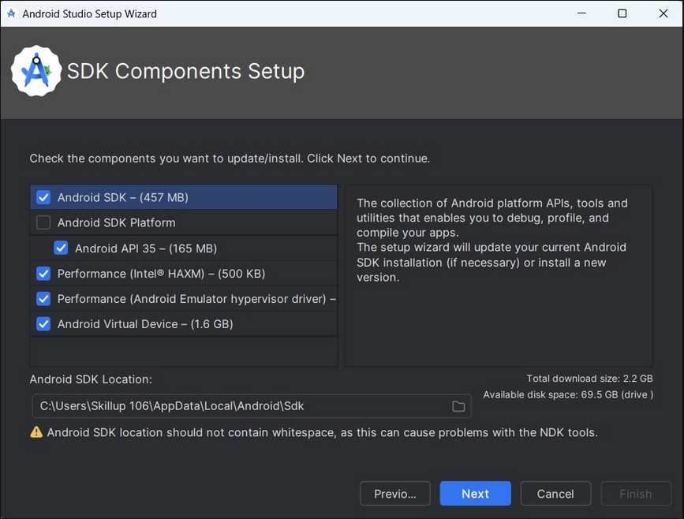
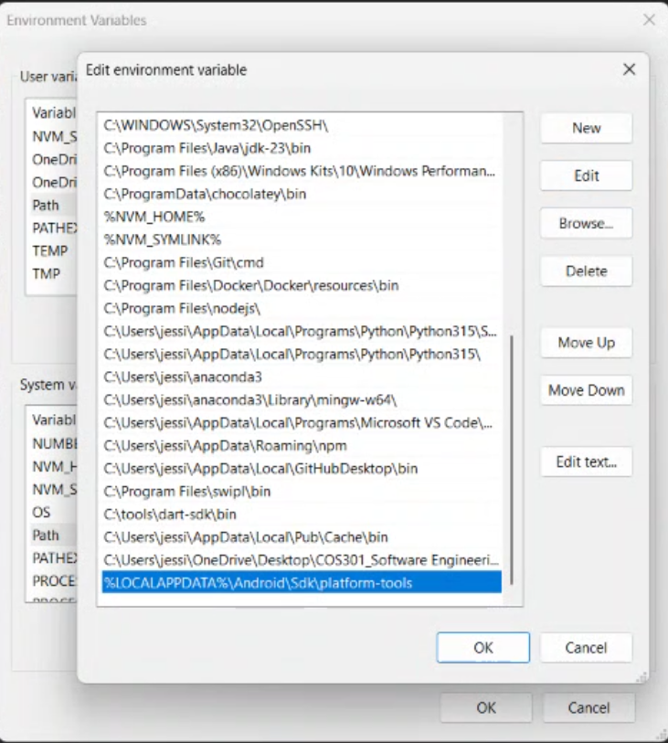
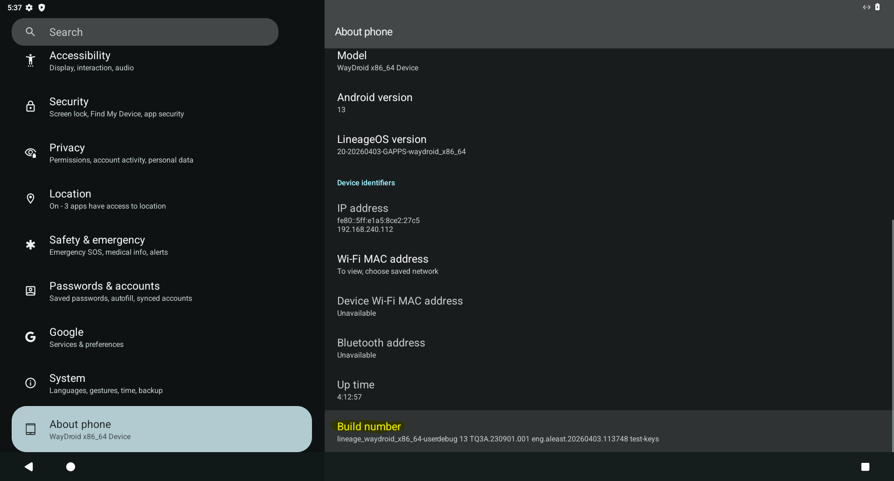
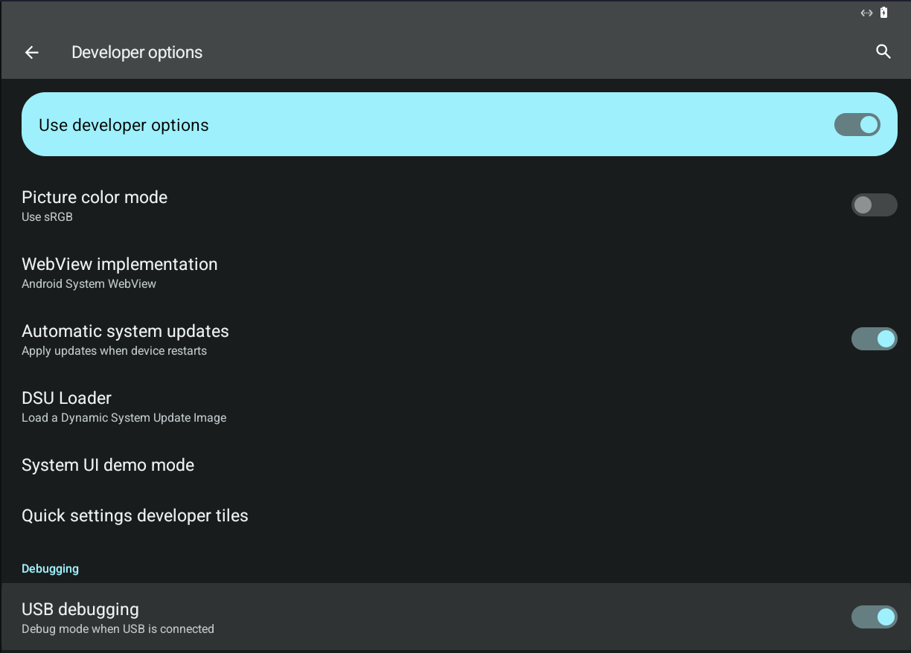
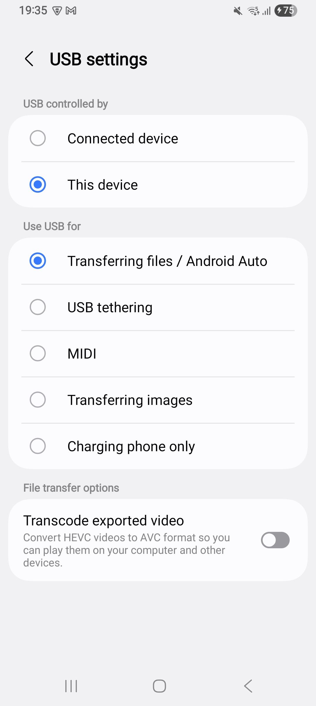
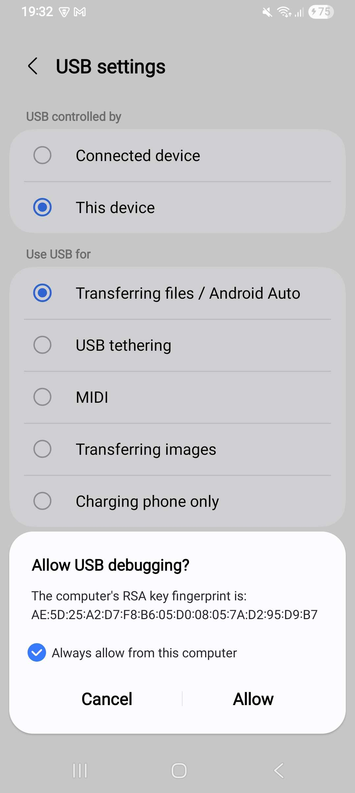
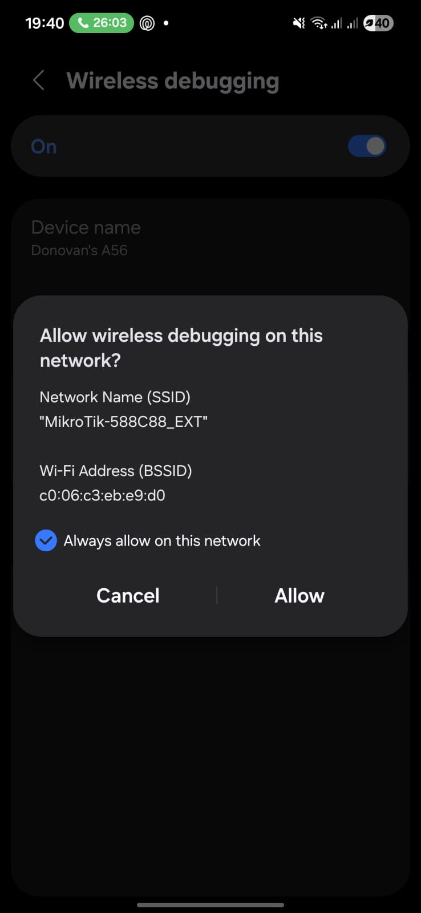
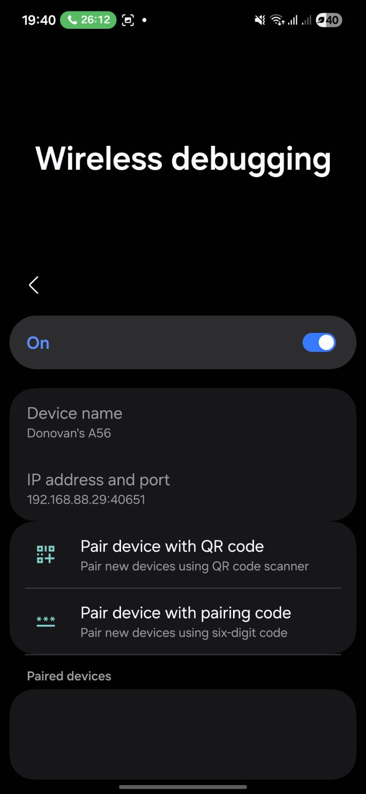
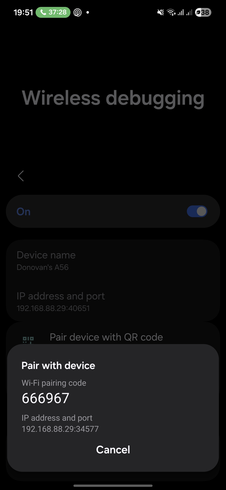

# ADB & Android Studio Setup

---

- [Windows](#windows)
- [WSL](#wsl)
- [Ubuntu / Debian](#ubuntu--debian)
- [Fedora / RHEL](#fedora--rhel)
- [Developer Options](#developer-options-enabling-on-your-phone)
- [USB Debugging](#usb-debugging-connecting-your-phone-via-cable)
- [Wireless 11+](#wireless-debugging-android-11-recommended)
- [Wireless 10-](#wireless-debugging-android-10-and-lower-usb--tcpip)
- [Emulator](#emulator-setup)
- [Commands](#useful-commands)

---

## Windows

### Install Android Studio

Download from [developer.android.com/studio](https://developer.android.com/studio) and run the installer.
Check the following components:

- Android Studio
- Android SDK
- Android SDK Platform
- Android Virtual Device



### Add ADB to PATH

ADB is installed at:

```
%LOCALAPPDATA%\Android\Sdk\platform-tools
```

1. Start -> search **Environment Variables** -> **Edit the system environment variables**
2. Environment Variables… -> System variables -> Path -> Edit
3. New -> paste the path above
4. OK on all dialogs, restart terminal



```powershell
adb version
```

### USB Drivers

- **Google devices :** Install the [Google USB Driver](https://developer.android.com/studio/run/win-usb) via Android Studio -> SDK Manager -> SDK Tools
- **Samsung:** Download from [Samsung Developers](https://developer.samsung.com/android-usb-driver)
- **Other manufacturers:** Download from your device manufacturer's website

If your device shows as "Unknown device" in Device Manager after plugging in, you need the OEM driver.

---

## WSL

Install an Ubuntu WSL distro, then follow the Ubuntu / Debian section inside WSL.
Android Studio runs on the Windows host.

> USB devices connected to the Windows host are accessible from WSL. Install ADB on
> both the Windows host and inside WSL. The ADB server runs on the host; WSL's `adb`
> connects to it automatically over TCP. If WSL cannot see devices, run
> `adb kill-server && adb start-server` on the Windows side first.

---

## Ubuntu / Debian

### Android Studio

```bash
sudo snap install android-studio --classic
```

### ADB only

```bash
sudo apt update
sudo apt install adb
```

### USB Permission 

```bash
sudo apt install android-sdk-platform-tools-common
sudo usermod -aG plugdev $USER
```

> Log out and back in for group changes to take effect.
> If your device still shows `no permissions`, find your device's USB vendor ID with
> `lsusb` and add a custom rule:
> ```bash
> echo 'SUBSYSTEM=="usb", ATTR{idVendor}=="XXXX", MODE="0666", GROUP="plugdev"' | sudo tee /etc/udev/rules.d/51-android.rules
> sudo udevadm control --reload-rules
> ```

---

## Fedora / RHEL

### ADB

```bash
sudo dnf install android-tools
```

### Android Studio

Download the Linux `.tar.gz` from [developer.android.com/studio](https://developer.android.com/studio).

```bash
tar -xzf android-studio-*.tar.gz -C ~/
~/android-studio/bin/studio.sh
```

### USB Permission (udev)

```bash
echo 'SUBSYSTEM=="usb", ATTR{idVendor}=="XXXX", MODE="0666", GROUP="plugdev"' | sudo tee /etc/udev/rules.d/51-android.rules
sudo udevadm control --reload-rules
sudo usermod -aG plugdev $USER
```

> Log out and back in. Replace `XXXX` with your device's vendor ID from `lsusb` if needed.

---

## Developer Options

### Step 1: Find Build Number



1. Open **Settings** on your Android device
2. Scroll down and tap **About phone** (or **About device** / **About tablet**)
3. Look for **Build number**: it may be under **Software information** on Samsung
   devices, or under **System** on some Android versions

### Step 2: Tap Build Number 7 Times

Tap **Build number** repeatedly. After a few taps you'll see a countdown
("You are 3 steps away from being a developer"). After the 7th tap you'll see
"You are now a developer!": enter your PIN/password if prompted.


> If nothing happens, Build number may be inside a sub-menu. On Samsung:
> Settings -> About phone -> Software information -> Build number.
> On Xiaomi/Redmi (MIUI): Settings -> About phone -> tap **MIUI version** instead.

### Step 3: Access Developer Options

Go back to the main **Settings** screen. You'll now see **Developer options**,
usually near the bottom, above or inside **System**.


> On some devices (OnePlus, Xiaomi) it appears under **Settings -> Additional settings ->
> Developer options**, or **Settings -> System -> Developer options**.

---

## USB Debugging: Connecting Your Phone via Cable

### Step 1: Enable USB Debugging

1. Open **Settings -> Developer options**
2. Find **USB debugging** (under the "Debugging" section)
3. Toggle it **ON**
4. Read the dialog explaining what USB debugging allows, then tap **OK**


### Step 2: Connect the Cable

1. Plug your phone into your computer with a USB cable
2. On your phone, a notification may appear: "Charging this device via USB"
3. Tap it and change the USB mode to **File Transfer (MTP)** or **PTP**.



### Step 3: Trust the Computer (RSA Key Fingerprint)

The first time you connect to a new computer, your phone shows a dialog:

```
Allow USB debugging?

The computer's RSA key fingerprint is:
AB:CD:EF:12:34:56:78:90:AB:CD:EF:12:34:56:78:90

[X] Always allow from this computer

        [Deny]    [Allow]
```



1. Verify the fingerprint is shown (this proves the connection is to your computer,
   not a malicious USB port)
2. Check **Always allow from this computer** so you don't have to repeat this
3. Tap **Allow**

> If you accidentally tapped **Deny**, unplug the cable, toggle USB debugging off
> and on again in Developer Options, then reconnect.

### Step 4: Verify the Connection

On your computer:

```bash
adb devices
```

You should see:

```
List of devices attached
R5CT123ABCD    device
```

If you see `unauthorized` instead of `device`, check your phone screen ,the
RSA key prompt may still be waiting.

If you see nothing at all:
- Try a different USB cable 
- Try a different USB port
- Run `adb kill-server && adb start-server` and try again
- Switch USB debugging off and on, then reconnect

---

## Wireless Debugging: Android 11+ (Recommended)

### Step 1: Enable Wireless Debugging on Your Phone

1. Open **Settings -> Developer options**
2. Under the "Debugging" section, find **Wireless debugging**
3. Toggle it **ON**
4. Tap **Allow** on the confirmation dialog





### Step 2: Find Your Phone's IP Address

While still on the Wireless debugging screen:

The screen shows the device's IP address and port at the top:

```
Wireless debugging

Connected to Wi-Fi

IP address & port
192.168.1.42:45678
```

Write down the IP address and port. The port after the colon changes each time
you toggle wireless debugging off and on.

### Step 3: Pair with a Pairing Code

1. On the Wireless debugging screen, tap **Pair device with pairing code**
2. The phone shows:

```
Pair with device

IP address: 192.168.1.42
Pairing port: 37891
Wi-Fi pairing code: 123456

This code will be used to verify your
connection. It will update automatically.
```



> This screen refreshes the pairing code from time to time. If it expires while you're
> typing, tap back and re-enter to get a new code.

3. On your computer, run:

```bash
adb pair 192.168.1.42:37891
```

4. When prompted, type the 6-digit pairing code from your phone:

```
Enter pairing code: 123456
Successfully paired to 192.168.1.42:37891 [guid=...]
```

5. On your phone, the pairing screen closes automatically. You'll see
   "Wireless debugging connected" in a notification. The paired device
    now appears under **Settings -> Developer options -> Wireless debugging ->
    Paired devices**.


### Step 4: Connect

Go back to the Wireless debugging screen to find the **connection port**.
This is different from the pairing port you used above.

```
IP address & port
192.168.1.42:45678
```

```bash
adb connect 192.168.1.42:45678
```

Expected output:

```
connected to 192.168.1.42:45678
```

### Step 5: Verify

```bash
adb devices
```

```
List of devices attached
192.168.1.42:45678    device
```

### Troubleshooting Wireless Debugging

**"failed to authenticate" or "failed to connect":**
The pairing code may have expired. Go back to Pair device with pairing code
on your phone to get a fresh code and try again.

**Connection drops after a few minutes:**
Some Wi-Fi networks block peer-to-peer traffic.
Try a hotspot or your home network. 
Also check that your phone isn't switching Wi-Fi networks or going to sleep: keep the screen on during use.

**`adb devices` shows `offline`:**
Your phone may have revoked the authorization. Toggle Wireless debugging off
and on, pair again, and reconnect.

**Device not visible after reboot:**
Wireless debugging resets on reboot. Re-enable it in Developer Options and
reconnect. The pairing is remembered: you only need to `adb connect` again,
not re-pair.

---

## Wireless Debugging: Android 10 and Lower (USB + TCP/IP)

For Android 10 and below, wireless debugging requires an initial USB connection
to enable the TCP/IP mode. 

### Step 1: Connect via USB First

1. Enable USB debugging (see USB section above)
2. Connect your phone via USB cable and trust the computer
3. Verify: `adb devices` shows `device`

### Step 2: Switch to TCP/IP Mode

```bash
adb tcpip 5555
```

Expected output:

```
restarting in TCP mode port: 5555
```

This tells the ADB daemon on your phone to start listening on port 5555
for wireless connections instead of just USB.

### Step 3: Find Your Phone's IP Address

On your phone: **Settings -> About phone -> Status -> IP address**

Example: `192.168.1.42`

### Step 4: Connect Wirelessly

```bash
adb connect 192.168.1.42:5555
```

Expected output:

```
connected to 192.168.1.42:5555
```

### Step 5: Disconnect USB

Unplug the USB cable. Verify the connection is still alive:

```bash
adb devices
```

```
List of devices attached
192.168.1.42:5555    device
```

### Switching Back to USB Mode

```bash
adb usb
```

---

## Emulator Setup

> **WSL users:** The emulator cannot run inside WSL. Run it on the Windows host
> via Android Studio, and Flutter inside WSL will detect it automatically over ADB.

### Step 1: Enable VM Acceleration

The emulator performs best with hardware acceleration. This requires a one-time setup.

**Windows / WSL:** Enable [Intel HAXM](https://github.com/intel/haxm) or
[Windows Hypervisor Platform](https://developer.android.com/studio/run/emulator-acceleration#vm-windows)
in **Android Studio -> SDK Manager -> SDK Tools**.

**Linux:** Ensure KVM is available:

```bash
sudo apt-get install qemu-kvm
sudo usermod -aG kvm $USER
```

Log out and back in.

> See [developer.android.com/studio/run/emulator-acceleration](https://developer.android.com/studio/run/emulator-acceleration)
> for platform-specific details.

### Step 2: Create a Virtual Device (AVD)

1. Android Studio -> **Tools** -> **Device Manager**
2. Click **Create Virtual Device**
3. Choose a device definition -> **Next**
4. Select a system image
5. Click **Download** next to the image if it isn't installed yet
6. Under Emulated Performance, select **Hardware - GLES 2.0**
7. Review the configuration -> **Finish**

### Step 3: Start the Emulator

**From Android Studio:**

Click the **Run** (play) button next to your device in the Device Manager.

**From the command line:**

```bash
# List available virtual devices
emulator -list-avds

# Start one by name
emulator -avd Pixel_9_API_36
``
> The first cold boot takes 1-2 minutes. Keep the emulator window open.
> Closing it shuts down the virtual device.

### Step 4: Verify

```bash
adb devices
```

You should see the emulator listed:

```
List of devices attached
emulator-5554    device
```

Flutter will also detect it:

```bash
flutter devices
```

```
Pixel 9 (emulator) • emulator-5554 • android • Android 14 (API 34)
```

### Step 5: Run Your App

```bash
make flutter-run
```

Flutter picks up the running emulator automatically. If both an emulator and
a physical device are connected, specify the target with `-d`:

```bash
make flutter-devices
cd Flutter/budgetit && fvm flutter run -d emulator-5554
```

### Useful Emulator Commands

| Command | Description |
|---|---|
| `emulator -list-avds` | List all created virtual devices |
| `emulator -avd <name>` | Start a virtual device by name |
| `emulator -avd <name> -no-snapshot` | Cold boot (skip saved state) |
| `adb -s emulator-5554 shell` | Open shell on the emulator |
| `adb -s emulator-5554 install app.apk` | Install an APK on the emulator |

---

## Useful Commands

| Command | Description |
|---|---|
| `adb devices` | List connected devices |
| `adb devices -l` | List devices with transport ID and model info |
| `adb install app.apk` | Install an APK |
| `adb uninstall com.example.app` | Uninstall by package name |
| `adb shell` | Interactive shell on the device |
| `adb push local/file /sdcard/` | Copy a file to the device |
| `adb pull /sdcard/file ./` | Copy a file from the device |
| `adb logcat` | View device logs (streaming) |
| `adb logcat -s TAG` | Filter logs by tag |
| `adb reboot` | Reboot the device |
| `adb kill-server` | Stop the ADB server |
| `adb start-server` | Start the ADB server |
| `adb disconnect` | Disconnect all wireless devices |
